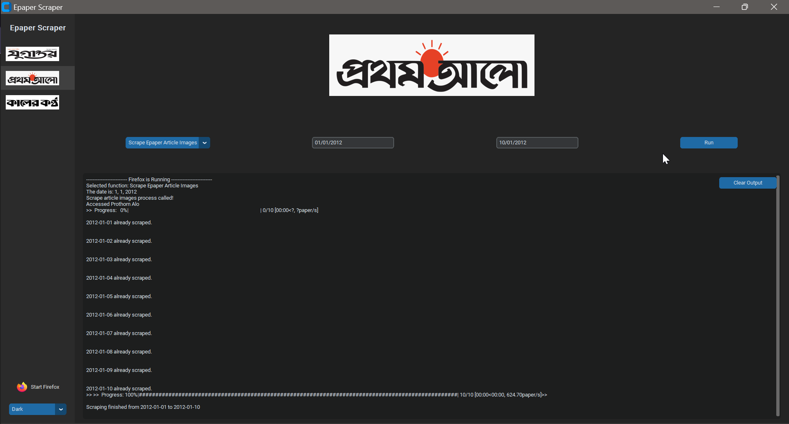

# Epaper Scraper

This is a Python-based web scraper for extracting data from online newspapers. Tested on [Jugantor](https://epaper.jugantor.com/) and [Prothom Alo](https://epaper.prothomalo.com/Home/) newspaper from 2012 to 2024 in a Windows 11 machine.

## Installation

### Prerequisites

Before installing the scraper, ensure you have the following prerequisites:

- A Windows machine (Tested on Windows 11)
- [Python 3.12.0](https://www.python.org/downloads/release/python-3120/) installed on your system 
- [Anaconda](https://www.anaconda.com/download/) for installing some packages
- [NVIDIA CUDA Toolkit 12.4](https://developer.nvidia.com/cuda-downloads?target_os=Windows) for GPU accelerated processes
- [Firefox](https://www.mozilla.org/en-US/firefox/new/) installed as your browser. Make sure to install it in `C:\Program Files\Mozilla Firefox\`

### Installation Steps

#### CUDA Toolkits

*Only NVIDIA GPUs are supported for now and the ones which are listed on [this page](https://developer.nvidia.com/cuda-gpus). If your graphics card has CUDA cores, then you can proceed further with setting up things. If not, contact the developer*.

1. Make sure that Nvidia drivers are upto date.

2. Add anaconda to the environment and run the following commands in the command prompt.

```bash
conda install numba
conda install cudatoolkit
```
*__NOTE:__ If Anaconda is not added to the environment then navigate to anaconda installation and locate the Scripts directory and open the command prompt there*. 

#### Tesseract

1. Download the Tesseract OCR executable from [here](https://github.com/UB-Mannheim/tesseract/wiki).

2. Install Tesseract OCR by following the installation instructions provided in the repository. Make sure to install it in `C:\Program Files (x86)\Tesseract-OCR`.

3. Open a command prompt or Anaconda prompt.

4. Navigate to the directory where you have cloned or downloaded the epaper-scraper repository.

5. Create and activate a virtual environment (optional but recommended):

    ```bash
    python -m venv venv
    venv\Scripts\activate
    ```

6. Install the required Python packages using pip:

    ```bash
    pip install -r requirements.txt
    ```

7. Test if Tesseract OCR is installed correctly by opening a Python prompt and running:

    ```python
    import pytesseract
    print(pytesseract)
    ```

    If you don't encounter any errors, Tesseract OCR is installed successfully.

## Usage

There are two ways to use this software: **With GUI** and **Without GUI**.

To use the epaper-scraper **With GUI**, follow these steps:

1. Run `main.py` from `src`, which will initiate a desktop application like the following one:



2. Navigate through the interface for using the supported capabilities of the software.

*__Note:__ The GUI lacks advanced features which are available in the "Without GUI" version. The interface is being constantly updated to implement these features.*

To use the **advanced features** of epaper-scraper **Without GUI**, follow these steps:

1. Click and run `start_firefox.bat` file. Alternatively run the commands from `cmd.txt`. This will initilize a firefox browser instance. 

2. Call functions and adjust parameters from the python files of `src` and run.
Example:
    ```bash
    python main.py
    ```

3. The scraper will start extracting data from the specified newspaper website and save it to the specified output directory.

